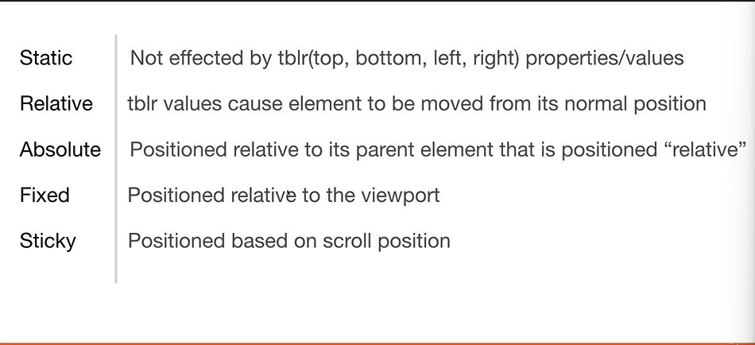

# CSS

# Sumário

1. [CSS](#item1)
2. [CSS Selectors](#item2)
3. [Fonts in CSS](#item3)
4. [CSS Colors](#item4)
5. [Backgrounds & Borders](#item5)
6. [Box Model Margin & Padding](#item6)
7. [Positioning](#item7)

## CSS

CSS inline declara os estilos dentro da tag

CSS interno declara os estilos no cabeçalho da página

CSS externo declara os estilos em um arquivo separado

## CSS Selectors

Selector | Exemplo | Exemplo de uso | Descrição
---------|---------|----------------|----------
Universal Selector | * | * | Seleciona todos os elementos
Type Selector | h1 | h1 | Seleciona todos os elementos h1
Class Selector | .intro | .intro | Seleciona todos os elementos com class="intro"
ID Selector | #firstname | #firstname | Seleciona o elemento com id="firstname"

## Fonts in CSS

Modificar Fontes de Texto

## CSS Colors

Cores podem ser definidas de várias formas:

- Hexadecimal
- RGB
- RGBA
- HSL
- HSLA
- Nome da Cor

## Backgrounds & Borders

Personalizar backgrounds e bordas e textos

## Box Model Margin & Padding

Cria caixa para englobar textos

## Positioning

